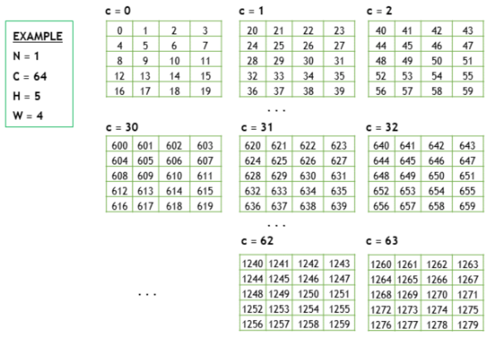
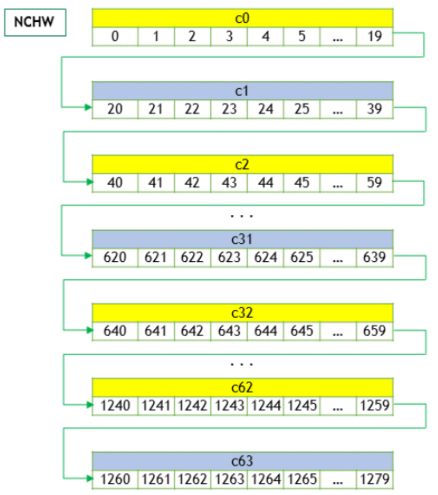
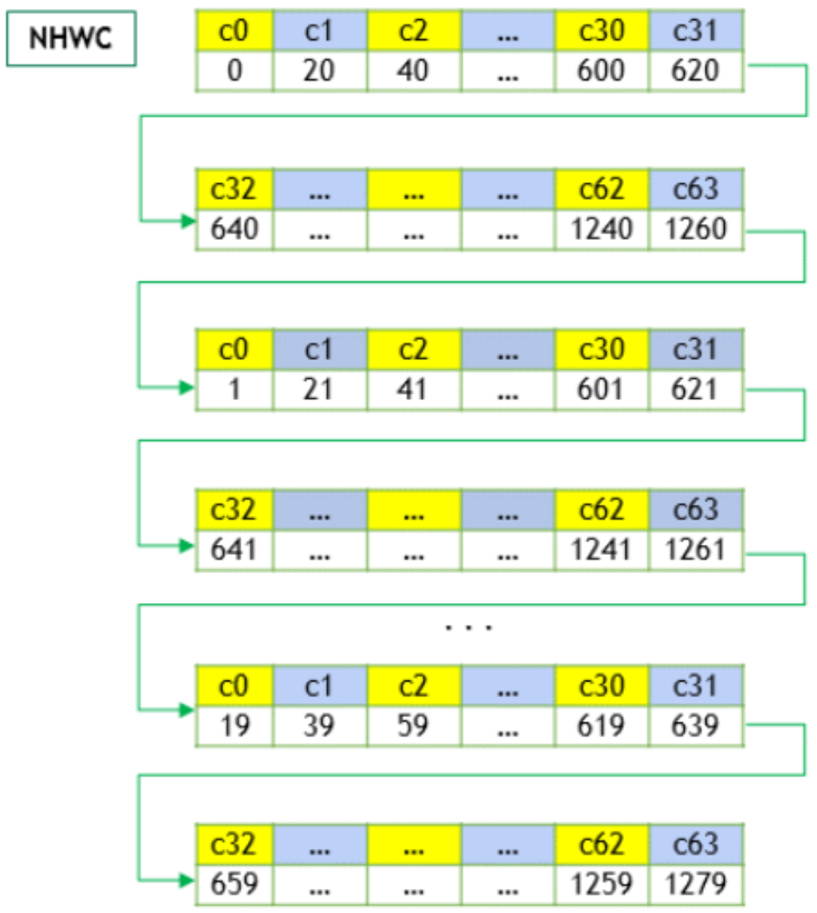
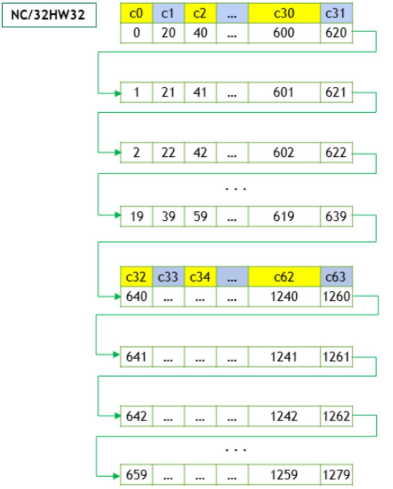
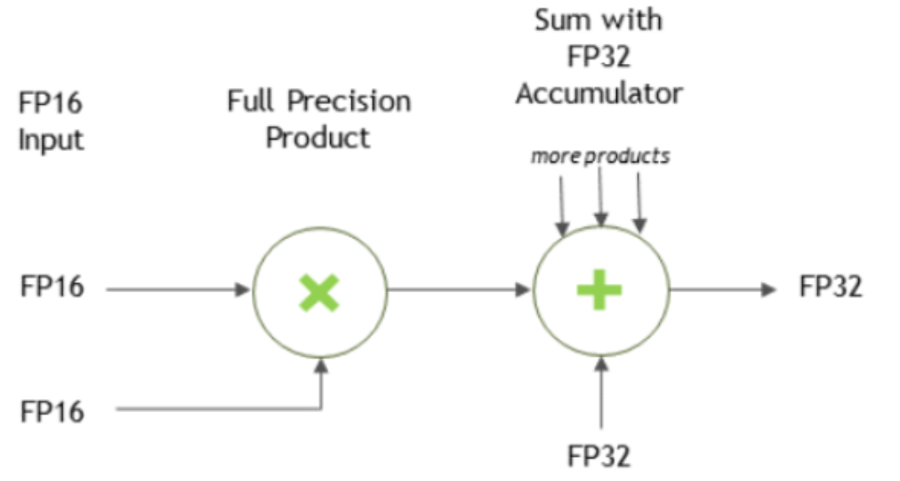

# 核心概念

在讨论graph和legacy API的细节之前，这一部分先介绍两者共同的核心概念。

## cuDNN Handle

cuDNN库暴露了一系列主机API，但是假设所有用到GPU的op，其必要的数据都可以直接从设备上访问。

使用cuDNN的应用必须先调用`cudnnCreate()`来初始化句柄。这个句柄会被显示传递给后续操作GPU数据的函数。应用可以通过调用`cudnnDestroy()`来释放句柄关联的资源。这中方法允许用户在使用多个主机线程、多个GPU或多个CUDA流时显示控制cuDNN库的功能。

例如，一个应用可以使用`cudaSetDevice`（在创建cuDNN句柄之前）在不同的主机线程里关联不同的设备，然后再每个主机线程里，创建一个唯一的cuDNN句柄，用于指定该线程中所有的cuDNN API调用都作用于该线程关联的设备。这种情况下，使用不同句柄的cuDNN库调用将自动运行在不同的设备上。

cuDNN假定在`cudnnCreate()`创建句柄后，直到调用`cudnnDestroy()`销毁句柄之前，句柄所关联的设备保持不变。如果要在同一个主机线程中使用不同的设备，应用必须通过`cudaSetDevice`设定新设备，然后重新使用`cudnnCreate()`创建一个cuDNN句柄，这个句柄会关联到新设备。

## Tensors and Layouts

无论使用graph API还是legacy API，cuDNN操作都会使用tensors作为输入，并产生tensors作为输出。

### Tensor Descriptor

cuDNN库使用一个通用的n-D Tensor描述符来描述数据。可以通过如下参数来定义一个Tensor描述符：

* 数据的维度（3-8维）
* 数据类型（32-bit 浮点，64-bit 浮点，16-bit 浮点......）
* 一个定义每个维度值的整型数组
* 一个定义每个维度跨距的整型数组（例如：获取当前维度下一个元素所需要跨越的元素数）

这种tensor定义允许某些维度数据相互重叠，例如，当前维度的跨距 < 下一个维度值 * 下一个维度的跨距（举例：nchw = [1, 2, 3, 4]，假设w的跨距是1，当h的跨距为w，也就是4 * 1，就没有重叠，但是当h的跨距是2，也就是2 < 4 * 1，h维度和w维度就存在重叠）。**在cuDNN里，除非另外指定，所有执行前向传播的函数中，输入tensor允许overlapping，所有输出tensor不支持overlapping。虽然Tensor描述支持负跨距（对数据镜像很有用），但除非另有规定，否则cuDNN函数不支持具有负跨距的Tensor。**

#### WXYZ Tensor Descriptor

tensor的格式可以使用各个维度的缩写来标识（例如：NHWC），在cuDNN文档中，使用这种描述方法意味着：

* 所有的跨距都是正的
* 字母对应维度的跨距按降序排列（例如：NHWC排列的tensor，n_stride >= h_stride >= w_stride >= c_stride）

#### 3-D Tensor Descriptor

一个3-D tensor通常用于矩阵乘法。具有三个维度：B，M，N。B代表batch size（对于单batch的GEMM，设置为1），M和N分别代表矩阵的行列数。更多信息可以参考`CUDNN_BACKEND_OPERATION_MATMUL_DESCRIPTOR`op（cuDNN graph API）。

#### 4-D Tensor Descriptor

4-D tensor descriptor使用4个字母（N，C，H，W）表示多batch的2D图像，N，C，H，W分别代表batch size，特征图数量，图像高度，图像宽度。以跨距值来降序排列这4个字母。最常用的4-D tensor格式是：

* NCHW
* NHWC
* CHWN

#### 5-D Tensor Descriptor

5-D tensor descriptor使用5个字母（N，C，D，H，W）表示多batch的3D图像，N，C，D，H，W分别代表batch size，特征图数量，图像深度，图像高度，图像宽度。以跨距值来降序排列这5个字母。最常用的5-D tensor格式是：

* NCDHW
* NDHWC
* CDHWN

#### Fully-Packed Tensors

一个tensor只有满足如下条件时，才被定义为`XYZ-fully-packed`：

* tensor的维度数等于`fully-packed`前面的字母数（例如：`NCHW-full-packed`，则此tensor的维度数必须为4。）
* 第`i`维度的跨距必须等于第`i+1`维度值乘以第`i+1`维度的跨距
* 最后一个维度的跨距必须是1

例如：一个格式是`NHWC`的tensor，假设N，H，W，C分别是1，2，3，4，则根据第三条，最后一个维度`C`的跨距必须是1，然后循环使用第2条，则可以得到`W`的跨距必须是`1 * 4(C维度的值) = 4`，`H`的跨距必须是`3(W维度值) * 4(W的跨距) = 12`，`N`的跨距必须是`2(H维度值) * 12(H的跨距) = 24`。同时，根据第一条，此tensor的维度数是4（只包含NHWC 4个维度），则这个tensor才是`NHWC-full-packed`。

#### Partially-Packed Tensors

一个 WXYZ tensor只有满足如下条件时，才被定义为`XYZ-packed`：

* 不在`-packed`中的维度的跨距必须大于或等于下一个维度值和下一个维度跨距的乘积。
* 在`-packed`中的维度，第`i`维度的跨距必须等于第`i+1`维度值和第`i+1`维度跨距的乘积。
* 如果最后一个维度在`-packed`中，则它的跨距必须是1。

例如：一个4-D tensor的格式是`NCHW`，N，C，H，W分别是1，2，3，4，若其是`CH-packed`，则根据第三条，最后一个维度`W`不在`CH-packed`中，其跨距可以不为1，假设其跨距是2，同时，假设`H`的跨距是3（随意设置的值，为了证明`CH`是否packed与`W`维度无关，故意没有设置为`4(W维度值) * 2(W维度跨距) = 8`），则根据第二条，`H`在`CH-packed`中，则`C`的跨距必须等于`3(H维度值) * 3(H维度跨距) = 9`，根据第一条，`N`的跨距必须大于等于`2(C维度值) * 9(C维度跨距) = 18`，这样才能说这个tensor是`CH-packed`。

#### Spatially Packed Tensors

Spatially-packed tensors被定义为在空间维度上packed的partially-packed tensor。也就是说对于spatially-packed 4D tensor，意味着无论是NCHW tensor还是CNHW tensor，都是HW-packed。

#### Overlapping Tensors

如果在整个维度范围内迭代时，多次取到相同的地址，则该tensor被定义为overlapping tensor。实践中，overlapping tensors意味着，对于某些维度`i`（在`[1, nbDims]`区间内），会存在`stride[i-1] < stride[i] * dim[i]`。

### Data Layout Formats

这一部分用几个tensor layout formats描述cuDNN tensors的内存排布。

指定tensor layout format的推荐方式是指定各个维度的strides。但是为了和v7系列API兼容，cuDNN也支持通过`cudnnTensorFormat_t `枚举类型来设置常用的几个tensor layout format。这个枚举类型仅用于历史兼容性，已经被标记为deprecated。

#### Example Tensor

假设存在一个batch的图像，尺寸如下：

* batch size **N**是1；
* feature maps（通道数）**C**是64；
* 图像高**H**是5；
* 图像宽**W**是4;

为了保持示例简单，图像像素值用整型序列（0，1，2，3等）表示。

下面的部分开始讲解几种不同的layout format下，上面的tensor是如何排布的。

#### Convolution Layouts

cuDNN中，卷积支持如下几种不同的layout。

##### NCHW Memory Layout

上面的4D tensor如果按照`NCHW`排布，其内存描述如下：

1. 首先排第一个通道（c=0），这个通道的`HW`按照row-major序（行主序）进行排布。
2. 继续排布第二个通道及后续通道，直至所有通道都排布完成。
3. 按照上面2步的排布继续排下一个batch（**N** > 1时）

##### NHWC Memory Layout

对于NHWC memory layout，**C**通道的元素首先被排布，具体排布如下：

1. 首先排0号通道的第一个元素，然后排1号通道的第一个元素，以此类推，直到所有通道的第一个元素都排完。
2. 其次，排布0号通道的第二个元素，然后排1号通道的第二个元素，以此类推，直到所有通道的第二个元素都排完。
3. 以raw-major（行主序）重复上面两步，直至元素全部排完。
4. 排布下一个batch（**N** > 1时）。

##### NC/32HW32 Memory Layout

NC/32HW32 layout和NHWC layout类似，但是有一个关键的不同点。NC/32HW32 layout下，64个通道被分为两组，每组32个通道，第一组排布`c0`-`c31`，第二组排布`c32`-`c63`。每组内的排布和NHWC排布相同。

对于通用的NC/xHWx layout，以下结论是适用的：

* 只有`C`维度（通道）被分组，每组包含`x`个通道。
* 当`x = 1`时，每组只有一个通道，因此，排当前组也就是排当前通道，排下一个组，也就是排下一个通道，这也就是NCHW foramt。
* 当`x = C`时，NC/xHWx就是NHWC，也就是说，所有通道`C`被排到同一个组里了。`x = C`也可以理解为所有`C`维度被向量化，放入一个巨大的vector中。就像NHWC一样。
* `cudnnTensorFormat_t`里面的枚举值也可以用如下的方式进行解释——NCHW INT8x32 format实际上是`N x (C/32) x H x W x 32`(每个`W`包含32个`C`)，NCHW INT8x4就是`N x (C/4) x H x W x 4`（每个`W`包含4个`C`）。因此，`VECT_C`表示每个`W`由一个`C`的向量组成。

#### MatMul Layouts

正如上面描述的3-D Tensor Descriptor，矩阵乘使用3D tensors，使用BMN描述。其layout可以使用strides描述。下面展示了两个推荐的layouts：

* Packed Row-major：维度值 [B, M, N]，跨距strides是 [MN, N, 1]；
* Packed Column-major：纬度值 [B, M, N]，跨距strides是 [MN, 1, M]

对于3-D tensor来说，Unpacked layout也是支持的，但是支持的不是很好。

### Tensor Core Operations

从cuDNN v7开始，cuDNN对计算密集型函数，在受支持的GPU SM版本上，引入了Tensor Core硬件支持。Tensor Core操作从NVIDIA Volta GPU开始受支持。

Tensor Core操作加速矩阵的数学操作；cuDNN使用Tensor Core操作，用于加速FP16，FP32以及INT32的运算。通过`cudnnMathType_t`枚举类型将math mode设置为`CUDNN_TENSOR_OP_MATH`，则表示让cuDNN使用Tensor Core操作。

默认的math mode是`CUDNN_DEFAULT_MATH`，这个值表示cuDNN不会使用Tensor Core操作。`CUDNN_TENSOR_OP_MATH`会使用Tensor Core操作，这两种模式的计算时许不同，可能导致浮点数运算的结果有些许差异。

例如：使用Tensor Core操作进行两个矩阵相乘的操作，其结果与顺序进行的标量浮点运算产生的结果非常接近，但并不总是相同的。

然而，训练常见的深度学习模型，通过最终网络精度和网络收敛时的迭代次数来对比，使用Tensor Core运算和标量浮点运算之间的差异可以忽略不计。因此，cuDNN将这两种模式视为在功能上不可区分，并允许在Tensor Core操作不适于使用的条件下，回退到标量运算上。

以下深度学习kernel可用Tensor Core运算：

* Convolutions
* RNNs
* Multihead Attention

可以访问[NVIDIA Training with Mixed Precision](https://docs.nvidia.com/deeplearning/performance/mixed-precision-training/index.html)获取更多信息。

对于深度学习编译器，以下是关键指南：

* 若要确保卷积操作符合Tensor Core的使用条件，就要避免使用大尺寸的padding和大尺寸的filter，两者的任意组合都不行。
* 将inputs和filters都转化为NHWC格式，并且将channel和batch size都填充为8的倍数。
* 确保所有用户提供的tensors，workspace，以及reserve space都对齐到128-bit边界。注意1024-bit对齐可以产生更好的性能。

### Notes on Tensor Core Precision

对于FP16的数据，Tensor Core操作FP16的输入，产生FP16的输出，可能使用FP16和FP32进行累加。对于使用FP32累加，产生FP16输出的运算，输出值将会down-converted为FP16。通常，累加类型和输出类型具有相同精度或更高精度。

