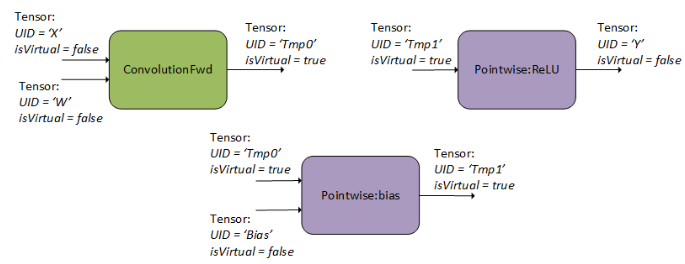
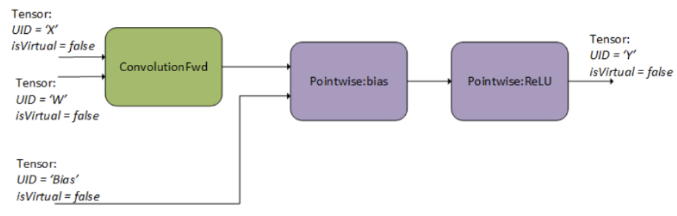

# Graph API

为了适应越来越重要的算子融合需求，cuDNN8.0版本引入了Graph API，以提供更灵活的API接口。Graph API提供一个声明式的编程模型，此模型将计算操作描述为计算图。

用户首先需要构建操作图。从高层面来说，用户其实是在描述各operations所操作的tensor的数据流图。一旦一个graph最终确定，用户需要选择并配置一个engine，用于执行该graph。选择并配置engines的方法不止一种，这些方法都是在易用性，运行时开销，以及engine性能间进行权衡。

Graph API有如下两种入口点：
* [Backend Descriptor Types](https://docs.nvidia.com/deeplearning/cudnn/api/cudnn-graph-library.html#graph-backend-desc-types)（最底层Graph API的入口点）
* [NVIDIA cuDNN Frontend API](https://github.com/NVIDIA/cudnn-frontend)

基于以下几点原因，我们期望用户使用**cuDNN frontend API**：

* frontend API使用简单，不那么冗长，通过backend API可访问的所有功能，也可以通过frontend API访问。
* frontend API在backend API之上添加了一些功能，比如错误过滤以及autotuning。
* frontend API是开源的。

无论是frontend API还是backend API，他们的高层概念是相同的。

## 核心概念

就像之前提到过的，graph API的核心概念是：

* Operations and Operation Graphs
* Engines and Engine Configurations
* Heuristics

下面我们先展开聊聊，最后用一个例子讲它们串起来。

### Operations and Operation Graphs

一个计算图实际就是各operations所操作tensor的数据流图。该图是一个数学规范，与底层执行该数学操作的engines进行解耦，因为对于一个给定的计算图，底层可能有多个engine可用。

输入/输出 tensor隐式定义了operation之间的连接，例如：operation A以tensor X为输出，然后该tensor X作为operation B的输入，此过程隐含说明operation B依赖operation A。

### Engines and Engine Configurations

对于一个给定的计算图，底层可能有多个候选engine可以用于实现该图。查找候选engine列表的典型方式是通过启发式查找（heuristics query，后面会介绍）。

一个engine会有一些knobs，用于配置engine的相关属性（如 tile size，相关信息请参考[cudnnBackendKnobType_t](https://docs.nvidia.com/deeplearning/cudnn/api/cudnn-graph-library.html#cudnnbackendknobtype-t)）

### Heuristics

对于一个给定的计算图来说，heuristic代表一种获取engine配置列表的方法，使用这些配置的engine可以执行该计算图，同时，heuristic方法会对这些配置按照性能从高到低进行排序。目前cuDNN内置了三种模式：

* `CUDNN_HEUR_MODE_A`：旨在提供更快的性能，同时能够处理大部分计算图模式。它返回一个按预期性能排序的engine配置列表。
* `CUDNN_HEUR_MODE_B`：通常比`CUDNN_HEUR_MODE_A`具备更高的计算精度，但是是以更高的CPU延迟作为代价。在确定模式A可以做得更好的情况下，底层实现可能会回退到模式A heuristic。
* `CUDNN_HEUR_MODE_FALLBACK`：目标也是提供更快的性能，但是可能为了满足功能而回退到非最佳性能的配置上。

推荐的工作流是先查询模式A和B，看是否有engine配置支持当前计算图。第一个支持当前计算图的配置就是性能最好的配置。

用户可以选择自己进行"auto-tune"，也就是说，在一个特定的device上，对一个特定的问题，迭代所有engine配置，并对它们进行计时，然后选择性能最好的一个。cuDNN frontend API提供了一个方便的函数`cudnnFindPlan()`来做这件事。

如果所有的engine配置都不被支持，再使用`CUDNN_HEUR_MODE_FALLBACK`回退，以此来优先满足功能需求。

高级用户可能想要根据engine的某些属性来过滤engine配置（如通过数值注释，行为注释或者adjustable knobs来过滤）。Numerical notes告知用户engine的数值属性，例如engine是否对输入或输出的datatype执行down conversion。Behavior notes可以包含一些底层实现的信息，例如，底层实现是否采用了运行时编译等。Adjustable knobs允许对engine的行为和性能进行更精细的控制。

## Graph API Example with Operation Fusion

接下来，作为示例，我们使用graph API实现convolution+bias+activation的算子融合。

### Creating Operation and Tensor Descriptors to Specify the Graph Dataflow

首先，创建三个cuDNN backend operation descriptors。

如下图所示，用户指定了一个前向卷子操作（使用`CUDNN_BACKEND_OPERATION_CONVOLUTION_FORWARD_DESCRIPTOR`），一个用于添加bias的pointwise操作（使用`CUDNN_BACKEND_OPERATION_POINTWISE_DESCRIPTOR`），一个用于ReLU激活的pointwise操作（使用`CUDNN_BACKEND_OPERATION_POINTWISE_DESCRIPTOR`并设置模式为`CUDNN_POINTWISE_RELU_FWD`）。如何设置这些descriptor的属性可以参考[Backend Descriptor Types](https://docs.nvidia.com/deeplearning/cudnn/api/cudnn-graph-library.html#graph-backend-desc-types) 。关于如何设置forward convolution，可以参考另一个示例：[Setting Up An Operation Graph For A Grouped Convolution use case](https://docs.nvidia.com/deeplearning/cudnn/api/cudnn-graph-library.html#graph-setup-op)。

用户还需要为这些operations创建用于输入和输出的tensor descriptor。图的数据流由这些tensor的关系确定，例如，将backend tensor `Tmp0`指定为convolution operation的输出，同时将其指定为bias operation的输入，cuDNN就可以推导出数据流是从卷积流向bias。同样的规则适用于tensor `Tmp1`。如果用户不需要将中间值`Tmp0`和`Tmp1`用作其他用途，则可以将它们指定为virtual tensors，这样的话内存I/O操作可以被优化掉。

* 拥有1个以上operation节点的图，不支持in-place operations（也就是说，任意的输入tensor的UIDs和输出tensor的UIDs不能相同）。
* operation descriptors可以以任意顺序创建并传递给cuDNN，因为使用tensor的UIDs就可以决定计算图的依赖顺序。

### Finalizing The Operation Graph

第2步，用户finalizes操作图。作为finalization的一部分，cuDNN执行数据流分析，以建立operations之间的依赖关系，并连接计算图的边，如下图所示。在这一步，cuDNN执行大量检查以确定图的有效性。

### Configuring An Engine That Can Execute The Operation Graph

第3步，对于一个给定的finalized计算图，用户必须选择并配置一个engine，形成一个execution plan，以执行该图。

正如Heuristics小节提到的，这一步的典型方法如下：

1. 查询heuristics模式A和B。

2. 查找第一个支持该计算图的engine config（或者对所有engine configs执行auto-tune，并找到一个支持的）

3. 如果在2)中，找不到可用的engine config，则尝试fallback heuristic。

### Executing The Engine

最后，execution plan已经构建好，是时候去运行它了。用户应该提供workspace指针，UID数组以及device指针数组来构建backend参数包。UID数组和指针数组应该一一对应。使用handle，execution plan以及参数包，execution API可以被调用，然后计算操作被下发到GPU上。
