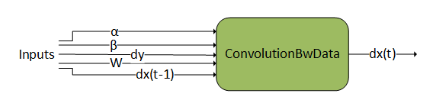
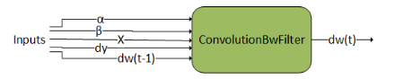
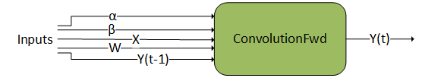
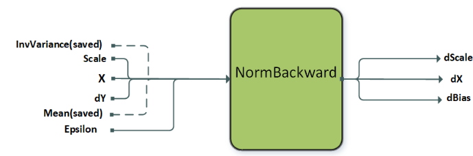
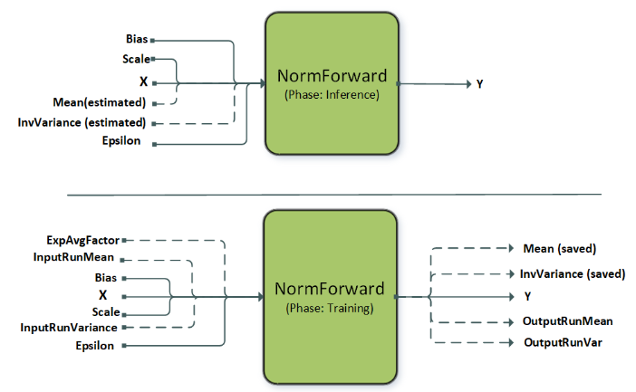

# Supported Graph Patterns

cuDNN Graph API支持一系列graph pattern。大量的engine为这些模式提供支持，每个engine都有各自的适用范围。所有的engine被分为4大类：pre-compiled single operation engines（预编译的单算子engine），generic runtime fusion engines（通用运行时融合engine），specialized runtime fusion engines（专用的运行时融合engine），specialized pre-compiled fusion engines（专用的预编译融合engine）。专用engine，无论是运行编译还是预编译，其目标都是一组重要的用例，因此，它们目前支持的pattern相当有限。随着时间的推移，我们期望使用通用的运行时融合engine来支持这些用例。

由于这些engine支持的pattern存在重叠，因此，一个给定的pattern可能存在0个，1个或多个engine支持。

# Pre-Compiled Single Operation Engines

此类engine只支持单算子的计算图。特别是：`ConvolutionFwd`， `ConvolutionBwFilter`，`ConvolutionBwData`，或者`ConvolutionBwBias`。关于这些engine的更精确的适用范围描述，可以在[NVIDIA cuDNN API Reference](https://docs.nvidia.com/deeplearning/cudnn/api/overview.html#api-overview)找到。

## ConvolutionBwData

`ConvolutionBwData`计算`dy`的卷积数据梯度`dx`，并使用缩放因子$\alpha$，$\beta$将结果值与之前的output进行混合。此graph操作类似于[cudnnConvolutionBackwardData()](https://docs.nvidia.com/deeplearning/cudnn/api/cudnn-cnn-library.html#cudnnconvolutionbackwarddata)。

## ConvolutionBwFilter

`ConvolutionBwFilter`计算`dy`的卷积权重梯度`dw`，并使用缩放因子$\alpha$，$\beta$将结果值与之前的output进行混合。此graph操作类似于[cudnnConvolutionBackwardFilter()](https://docs.nvidia.com/deeplearning/cudnn/api/cudnn-cnn-library.html#cudnnconvolutionbackwardfilter)。

## ConvolutionFwd

`ConvolutionFwd`通过`W`计算`X`的卷积，并使用缩放因子$\alpha$，$\beta$将结果值与之前的output进行混合。此graph操作类似于[cudnnConvolutionForward()](https://docs.nvidia.com/deeplearning/cudnn/api/cudnn-cnn-library.html#cudnnconvolutionforward)。

## NormalizationBackward

`NormalizationBackward`计算梯度`dX, dScale, dBias`。此操作支持多种模式，模式可以通过`CUDNN_ATTR_OPERATION_NORM_BWD_MODE`属性进行设置。预编译的engine支持instance和layer norm的backward传播，但是不支持batch norm的backward传播，batch norm的backward传播受专用运行时编译engine支持（参考[DReluForkDBn](https://docs.nvidia.com/deeplearning/cudnn/developer/graph-api.html#dreluforkdbn)）。前向训练过程中存储的均值和方差被传递给`NormBackward`操作。

下表是针对`NormalizationBackward`操作的*Instance Norm, Layer Norm, and RMS Norm*相关信息

| Node and Other Attributes           | Instance Normalization Backward     | Layer Normalization Backward        | RMS Normalization Backward          |
| ----------------------------------- | ----------------------------------- | ----------------------------------- | ----------------------------------- |
| `operation`                         | `normBwd`                           | `normBwd`                           | `normBwd`                           |
| `X`                                 | [N, C, (D), H, W], input, I type    | [N, C, (D), H, W], input, I type    | [N, C, (D), H, W], input, I type    |
| `Mean`                              | [N,C,(1),1,1], input, compute type  | [N,1,(1),1,1], input, compute type  | N/A                                 |
| `InvVariance`                       | [N,C,(1),1,1], input, compute type  | [N,1,(1),1,1], input, compute type  | [N,1,(1),1,1], input, compute type  |
| `Scale`                             | [1,C,(1),1,1], input weight, W type | [1,C,(D),H,W], input weight, W type | [1,C,(D),H,W], input weight, W type |
| `DY`                                | [N, C, (D), H, W], input, O type    | [N, C, (D), H, W], input, O type    | [N, C, (D), H, W], input, O type    |
| `DX`                                | [N, C, (D), H, W], output, I type   | [N, C, (D), H, W], output, I type   | [N, C, (D), H, W], output, I type   |
| `Dscale`                            | [1,C,(1),1,1], output, W type       | [1,C,(D),H,W], output, W type       | [1,C,(D),H,W], output, W type       |
| `Dbias`                             | [1,C,(1),1,1], output, W type       | [1,C,(D),H,W], output, W type       | Optional                            |
| `mode`                              | `CUDNN_INSTANCE_NORM`               | `CUDNN_LAYER_NORM`                  | `CUDNN_RMS_NORM`                    |
| Supported layout                    | NC(D)HW, N(D)HWC                    | NC(D)HW, N(D)HWC                    | NC(D)HW, N(D)HWC                    |
| Supported I and O types             | FP16, FP32, BF16                    | FP16, FP32, BF16                    | FP16, FP32, BF16                    |
| Supported compute type              | FP32                                | FP32                                | FP32                                |
| Supported W types                   | FP32                                | FP16, FP32, BF16                    | FP16, FP32, BF16                    |
| Alignment requirements for I/O type | 8 bytes aligned                     | 16 bytes aligned                    | 16 bytes aligned                    |

对于每种operation，所有适用的tensor必须具备相同的layout。混合形式的I/O type，或者混合形式的compute type都不受支持。

Layer Norm和RMS Norm同时也受专用运行时编译engine支持，`CUDNN_ATTR_ENGINE_GLOBAL_INDEX = 3`用于normalization backward操作。但是这些性能更好的engine，使用上受到`sizeof(Itype) >= sizeof(Otype)`的限制。

## NormalizationForward

`NormalizationForward`通过输入`X`计算normalization的输出`Y`。此operation在推理和训练过程中都会使用，可以通过`CUDNN_ATTR_OPERATION_NORM_FWD_PHASE`属性来标识是训练还是推理过程。

此operation支持多种不同的normalization模式，具体模式通过`CUDNN_ATTR_OPERATION_NORM_FWD_MODE`属性来指定。上图中的虚线表示可选输入，这些可选输入通常用于此操作的`batch norm`模式。目前，instance norm和layer norm都同时被预编译和专用运行时编译engine支持，而batch norm和RMS norm只被专用运行时编译engine支持（参考[BnAddRelu](https://docs.nvidia.com/deeplearning/cudnn/developer/graph-api.html#bnaddrelu)）。

下表是针对NormalizationForward操作的*Instance Norm, Layer Norm, and RMS Norm*相关信息

| Node and Other Attributes           | Instance Normalization Forward                               | Layer Normalization Forward                                  | RMS Normalization Forward                                    |
| ----------------------------------- | ------------------------------------------------------------ | ------------------------------------------------------------ | ------------------------------------------------------------ |
| `operation`                         | `normFwd`                                                    | `normFwd`                                                    | `normFwd`                                                    |
| `X`                                 | [N, C, (D), H, W], input, I type                             | [N, C, (D), H, W], input, I type                             | [N, C, (D), H, W], input, I type                             |
| `Mean`                              | [N,C,(1),1,1], output, compute type, only applicable to `fmode CUDNN_NORM_FWD_TRAINING` | [N,1,(1),1,1], output, compute type, only applicable to `fmode CUDNN_NORM_FWD_TRAINING` | N/A                                                          |
| `InvVariance`                       | [N,C,(1),1,1], output, compute type, only applicable to `fmode CUDNN_NORM_FWD_TRAINING` | [N,1,(1),1,1], output, compute type, only applicable to `fmode CUDNN_NORM_FWD_TRAINING` | [N,1,(1),1,1], output, compute type,only applicable to `fmode CUDNN_NORM_FWD_TRAINING` |
| `Scale`                             | [1,C,(1),1,1], input weight, W type                          | [1,C,(D),H,W], input weight, W type                          | [1,C,(D),H,W], input weight, W type                          |
| `Bias`                              | [1,C,(1),1,1], input weight, W type                          | [1,C,(D),H,W], input weight, W type                          | Optional (no bias by default)                                |
| `Y`                                 | [N, C, (D), H, W], output, O type                            | [N, C, (D), H, W], output, O type                            | [N, C, (D), H, W], output, O type                            |
| `epsilonDesc`                       | [1,1,1,1], input, constant                                   | [1,1,1,1], input, constant                                   | [1,1,1,1], input, constant                                   |
| `mode`                              | `CUDNN_INSTANCE_NORM`                                        | `CUDNN_LAYER_NORM`                                           | `CUDNN_RMS_NORM`                                             |
| Supported `fmode`                   | `CUDNN_NORM_FWD_TRAINING`, `CUDNN_NORM_FWD_INFERENCE`        | `CUDNN_NORM_FWD_TRAINING`, `CUDNN_NORM_FWD_INFERENCE`        | `CUDNN_NORM_FWD_TRAINING`, `CUDNN_NORM_FWD_INFERENCE`        |
| Supported layout                    | NC(D)HW, N(D)HWC                                             | NC(D)HW, N(D)HWC                                             | NC(D)HW, N(D)HWC                                             |
| Supported I and O types             | FP16, FP32, BF16                                             | FP16, FP32, BF16                                             | FP16, FP32, BF16                                             |
| Supported compute type              | FP32                                                         | FP32                                                         | FP32                                                         |
| Supported weight types, W type      | FP32                                                         | FP16, FP32, BF16                                             | FP16, FP32, BF16                                             |
| Alignment requirements for I/O type | 8 bytes aligned                                              | 16 bytes aligned                                             | 16 bytes aligned                                             |

对于每个operation，所有适用的tensor都必须具备相同的layout。

Layer Norm和RMS Norm同时受专用运行时编译engine支持，需要将`fmode`设置为`CUDNN_NORM_FWD_TRAINING`，同时`CUDNN_ATTR_ENGINE_GLOBAL_INDEX = 3`，或者`fmode`设置为`CUDNN_NORM_FWD_INFERENCE`，同时`CUDNN_ATTR_ENGINE_GLOBAL_INDEX = 4`。但是这些性能更好的engine受`sizeof(Itype) >= sizeof(Otype)`限制。对于非运行编译的engines，W type就是compute type。
