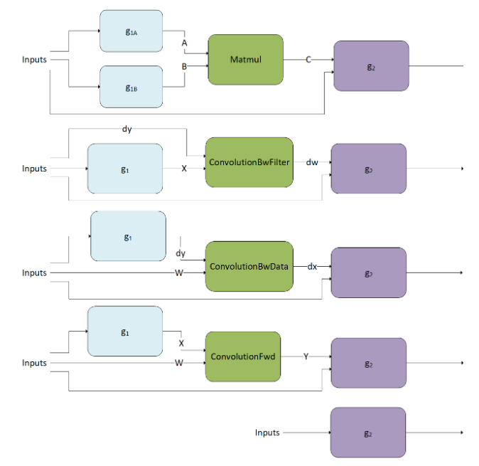

# Generic Runtime Fusion Engines

通用运行时融合engines支持多operation计算图，cuDNN可以在运行时，基于graph pattern，使用运行时融合engine产生kernel或kernels。此部分讲解这些被runtime fusion engines支持的pattern（runtime fusion engine使用`CUDNN_BEHAVIOR_NOTE_RUNTIME_COMPILATION`行为标注）。

先看通用运行时融合engine的适用范围：

1. `MatMul` fusions: $g_2(C = matmul(A = g_{1A}(inputs), B = g_{1B}(inputs), inputs)$
2. `ConvolutionFwd` fusions：$g_2(Y = convolutionFwd(X = g_1(inputs), W), inputs)$
3. `ConvolutionBwFilter` fusions：$g_2(d_w = convolutionBwFilter(d_y, X = g_1(inputs)), inputs)$
4. `ConvolutionBwData` fusions：$g_2(d_x = convolutionBwData(d_y = g_1(inputs), W), inputs)$
5. `Pointwise` fusions：$g_2(inputs)$

> 注意
>
> * $g_1$(包括$g_{1A}$和$g_{1B}$)表示应用到MatMul和卷积操作输入tensor的融合算子。
> * $g_2$表示应用到MatMul和卷积输出tensor的融合算子。
> * $g_2$可以有一个及一个以上的输出
> * 在$g_1$中的fusion patterns被称为mainloop fusion，在$g_2$中的fusion patterns被称为epilogue fusion(尾部融合)。
> * 进入$g_2$的箭头可以进入任意$g_2$节点，而不是必须指向root节点。
> * 操作的缩写符号用于所有图标和文本中，用于可视化的目的。

## Support Surface

generic runtime fusion engine包含三个独立的support surfaces，这三个support surfaces以90，80和70进行索引。一旦构建的cuDNN计算图完全满足某个support surface，该图就能够由通用运行时融合engine执行。下面的表总结了每个support surface的特征。通常来说，我们推荐用户针对最大索引的support surface来构建cuDNN Graph，小索引的support surface用作fallback plan。

*Summary of Supported Features of Each Support Surface*

| Feature                                                      | Support Surface 90  | Support Surface 80                      | Support Surface 70  |
| ------------------------------------------------------------ | ------------------- | --------------------------------------- | ------------------- |
| Compute Capability                                           | >= 9.0              | >= 8.0                                  | >= 7.0              |
| `MatMul` Fusions                                             | Supported           | Supported                               | Supported           |
| `ConvolutionFwd` Fusions                                     | Supported           | Supported                               | Supported           |
| `ConvolutionBwFilter` Fusions                                | Supported           | Not Supported                           | Supported           |
| `ConvolutionBwData` Fusions                                  | Partially Supported | Not Supported                           | Supported           |
| `Pointwise` and `Reduction` Fusions                          | Not Supported       | Not Supported                           | Supported           |
| FP8 `MatMul` and `Convolution` Operations                    | Supported           | Supported for Compute Capability >= 8.9 | Not Supported       |
| $g_1$ (Mainloop) Fusions                                     | Supported           | Supported                               | Partially Supported |
| $g_2$ (Epilogue) Fusions                                     | Supported           | Supported                               | Supported           |
| [Mixed Input GEMM](https://docs.nvidia.com/deeplearning/cudnn/latest/developer/graph-api.html#mixed-input-matmul) | Supported           | Supported                               | Not Supported       |
| Grouped Convolution                                          | Supported           | Supported                               | Not Supported       |

下面详细讲解每个support surface的特征。

### Support Surface 90

**Compute Capability**

* 计算能力9.0的NVIDIA GPUs受支持。

**Generic Limitations**

* Strided `ConvolutionBwData`融合不被支持。
* `Pointwise`和`Reduction`融合不被支持。

**Advanced Supports**

* Mixed input`MatMul`，`ConvolutionFwd`及`ConvolutionBwData`融合是受支持的。
* Grouped `ConvolutionFwd`，`ConvolutionBwFilter`及`ConvolutionBwData`融合是受支持的。

**I/O and Intermediate Data Type**

* 输入tensor的data type可以是`{FLOAT,INT32,HALF,BFLOAT16,INT8,FP8_E4M3,FP8_E5M2}`中的任意一个。
* `MatMul`，`ConvolutionFwd`，`ConvolutionBwFilter`以及`ConvolutionBwData`操作的input tensor的data type可以是`{FLOAT, HALF, BFLOAT16, INT8, FP8_E4M3, FP8_E5M2}`中的任意一个。
* 输出tensor的data type可以是`{INT64, FLOAT, INT32, HALF, BFLOAT16, INT8, UINT8, FP8_E4M3, FP8_E5M2}`中的任意一个。
* `CUDNN_BACKEND_OPERATION_REDUCTION_DESCRIPTOR`操作的输出tensor的data type只能是`FLOAT`。
* 中间过程的virtual tensor的data type可以是`{FLOAT, INT32, HALF, BFLOAT16, INT8, FP8_E4M3, FP8_E5M2}`中的任意一个，并且并且`code-generator`也遵守中间过程数据的数据类型限制。通常，推荐使用`FP32`。

**Compute Data Type**

* 对于`CUDNN_BACKEND_OPERATION_POINTWISE_DESCRIPTOR`操作，compute data type可以是`FP32`或`INT32`。
* 对于`CUDNN_BACKEND_OPERATION_REDUCTION_DESCRIPTOR`操作，compute data type只能是`FP32`。
* `MatMul`, `ConvolutionFwd`, `ConvolutionBwFilter`以及`ConvolutionBwData`操作的compute data type类型取决于输入tensor的data type。下表列出了可能的组合：

*Combinatory Support Surface of Input Data Type and Compute Data Type of* `MatMul` *and* `Convolution` *Operations*

| `MatMul` / `Convolution` Operation Input Data Type | `MatMul` / `Convolution` Operation Compute Data Type |
| -------------------------------------------------- | ---------------------------------------------------- |
| `INT8`                                             | `INT32`                                              |
| `FP8_E4M3`, `FP8_E5M2`                             | `FLOAT`, `FAST_FLOAT_FOR_FP8`                        |
| `HALF`                                             | `FLOAT`, `HALF`                                      |
| `BFLOAT16`                                         | `FLOAT`                                              |
| `FLOAT`                                            | `FLOAT`                                              |

**Mainloop Fusions: $g_1$**

* $g_1$ 是一个可以由任意数量（包含0）的`CUDNN_BACKEND_OPERATION_POINTWISE_DESCRIPTOR`操作组成的有向无环图（DAG）。
* 输入tensor必须是128位对齐。对于grouped `ConvolutionFwd`, `ConvolutionBwFilter`和`ConvolutionBwData`融合，要求按每个group来对齐。
* 所有的中间tensor必须都是virtual的。
* support surface的dimension以及layout如下表所列：

*Support Surface of Dimension and Layout for Tensors in $g_1$*

| Pattern                       | Dimension                                                    | Layout                                                       |
| ----------------------------- | ------------------------------------------------------------ | ------------------------------------------------------------ |
| `MatMul` fusions              | Tensor A  必须有如下维度：`dim[B, M, K] 或者 dim[1, M, K]`。输入到 $g_{1A}$ 的tensor维度可以是 `dim[1, 1, 1]`, `dim[B, 1, 1]`, `dim[1, M, 1]`, `dim[B, M, 1]`, `dim[1, 1, K]`, `dim[B, 1, K]`, `dim[1, M, K]`, 或者 `dim[B, M, K]`.Tensor B必须是 `dim[B, K, N] 或 dim[1, K, N]`.输入到 $g_{1B}$ 的tensor维度可以是 `dim[1, 1, 1]`, `dim[B, 1, 1]`, `dim[1, 1, N]`, `dim[B, 1, N]`, `dim[1, K, 1]`, `dim[B, K, 1]`, `dim[1, K, N]`, 或 `dim[B, K, N]`. | 所有的tensor layout可以是行主序或列主序，并且不需要所有tensor都采用相同的主序。 |
| `ConvolutionFwd` fusions      | Tensor X 必须有如下维度： `dim[N, C, (D,) H, W]`.对X进行tensor运算的维度可以是`dim[1, 1, (1,) 1, 1]`, `dim[1, C, (1,) 1, 1]`, or `dim[N, C, (D), H, W]`. 异常情况: `dim[1, C, (1,) 1, 1]` 与 grouped `ConvolutionFwd` fusions不兼容.Tensor W 必须是 `dim[K, C, (T,) R, S]`. | 所有tensors必须是fully packed NHWC layout.                   |
| `ConvolutionBwFilter` fusions | Tensor dy 必须是 `dim[N, K, (O,) P, Q]`.Tensor X 必须是 `dim[N, C, (D,) H, W]`.在$g_1$上的Fusion operation不受支持. | 当`ConvolutionBwFilter` operation的input data type  是`HALF` or `BFLOAT16`, 所有的tensor必须是 fully packed NHWC layout.当`ConvolutionBwFilter` operation的input data type  是  `FLOAT`, `INT8`, `FP8_E4M3`, or `FP8_E4M3`, 所有的tensor必须是 fully packed CHWN layout. |
| `ConvolutionBwData` fusions   | Tensor dy 必须是 `dim[N, K, (O,) P, Q]`.对dy进行张量运算的维度可以是`dim[1, 1, (1,) 1, 1]`, `dim[1, K, (1,) 1, 1]`, or `dim[N, K, (O,) P, Q]`.Tensor W 必须是 `dim[K, C, (T,) R, S]`. | 当`ConvolutionBwFilter` 的 input data type是 `HALF` or `BFLOAT16`, 所有tensor必须是fully packed NHWC layout。当`ConvolutionBwFilter` 的 input data type是 `FLOAT`, `INT8`, `FP8_E4M3`, or `FP8_E4M3`, 所有输入到$g_1$的tensor 必须是 fully packed NHWC layout, 并且 W tensor必须是 fully packed CHWN layout. |

**Epilogue Fusion: $g_2$**

* $g_2$ 也是一个可以由任意数量（包含0）的`CUDNN_BACKEND_OPERATION_POINTWISE_DESCRIPTOR`或`CUDNN_BACKEND_OPERATION_REDUCTION_DESCRIPTOR`操作组成的有向无环图（DAG）。
* `CUDNN_BACKEND_OPERATION_REDUCTION_DESCRIPTOR`只能作为$g_2$的exit nodes。
* 所有的input 和 output tensors都必须是32位对齐。对于grouped `ConvolutionFwd`, `ConvolutionBwFilter`和`ConvolutionBwData` fusions，要求按每个group来对齐。
* 对于`CUDNN_BACKEND_OPERATION_POINTWISE_DESCRIPTOR`操作，要进行broadcasted的tensor不能作为第一输入。
* support surface的dimension以及layout如下表所列：

*Support Surface of Dimension and Layout for Tensors in $g_2$*

| Pattern                             | Dimension                                                    | Layout                                                       |
| ----------------------------------- | ------------------------------------------------------------ | ------------------------------------------------------------ |
| `MatMul` fusions                    | Tensor C 必须是 `dim[B, M, N]`.输入到 $g_2$的其他tensor必须是 `dim[1, 1, 1]`, `dim[B, 1, 1]`, `dim[1, M, 1]`, `dim[B, M, 1]`, `dim[1, 1, N]`, `dim[B, 1, N]`, `dim[1, M, N]`, 或 `dim[B, M, N]`.从$g_2$输出的tensor必须是 `dim[B, M, N]`。如果$g_2$的最后一个操作是 `CUDNN_BACKEND_OPERATION_REDUCTION_DESCRIPTOR`, 最后一个输出tensor可以是 `dim[1, 1, 1]`, `dim[B, 1, 1]`, `dim[1, M, 1]`, `dim[B, M, 1]`, `dim[1, 1, N]`, `dim[B, 1, N]`, 或 `dim[1, M, N]`. | 所有的tensor可以是行主序或列主序，但是主序必须相同。如果存在`CUDNN_BACKEND_OPERATION_REDUCTION_DESCRIPTOR` operation, 所有tensor的layouts必须是行主序。 |
| `ConvolutionFwd` fusions            | Tensor Y 必须是`dim[N, K, (O,) P, Q]`.Dimensions of other input tensors to g 2 can be `dim[1, 1, (1,) 1, 1]`, `dim[N, 1, (O,) P, Q]`, `dim[1, K, (1,) 1, 1]`, or `dim[N, K, (O,) P, Q]`.Dimensions of output tensors from g 2 can be `dim[N, K, (O,) P, Q]`.If the last operation in g 2 is `CUDNN_BACKEND_OPERATION_REDUCTION_DESCRIPTOR`, the dimension of the last output tensor can be `dim[1, 1, (1,) 1, 1]`, `dim[N, 1, (O,) P, Q]`, `dim[1, K, (1,) 1, 1]`, `dim[N, K, (1,) 1, 1]`, or `dim[N, 1, (1,) 1, 1]`.Grouped `ConvolutionFwd` fusions cannot have `CUDNN_BACKEND_OPERATION_REDUCTION_DESCRIPTOR` operation in g 2. | All tensors must be fully packed NHWC layout.                |
| `ConvolutionBwFilter` fusions       | Tensor dw must have dimension `dim[K, C, (T,) R, S]`.Dimensions of other input tensors to g 2 can be `dim[1, 1, (1,) 1, 1]`, `dim[1, C, (T,) R, S]`, `dim[K, 1, (1,) 1, 1]`, or `dim[K, C, (T,) R, S]`.Dimensions of output tensors from g 2 can be `dim[K, C, (T,) R, S]`.If the last operation in g 2 is `CUDNN_BACKEND_OPERATION_REDUCTION_DESCRIPTOR`, the dimension of the last output tensor can be `dim[1, 1, (1,) 1, 1]`, `dim[1, C, (T,) R, S]`, or `dim[K, 1, (1,) 1, 1]`.Grouped `ConvolutionBwFilter` fusions cannot have `CUDNN_BACKEND_OPERATION_REDUCTION_DESCRIPTOR` operation in g 2. | All tensors must be fully packed NHWC layout.                |
| `ConvolutionBwData` fusions         | Tensor dx must have dimension `dim[N, C, (D,) H, W]`.Dimensions of other input tensors to g 2 can be `dim[1, 1, (1,) 1, 1]`, `dim[N, 1, (D,) H, W]`, `dim[1, C, (1,) 1, 1]`, or `dim[N, C, (D,) H, W]`.Dimensions of output tensors from g 2 can be `dim[N, C, (D,) H, W]`.If the last operation in g 2 is `CUDNN_BACKEND_OPERATION_REDUCTION_DESCRIPTOR`, the dimension of the last output tensor can be `dim[1, 1, (1,) 1, 1]`, `dim[N, 1, (D,) H, W]`, `dim[1, C, (1,) 1, 1]`, `dim[N, C, (1,) 1, 1]`, or `dim[N, 1, (1,) 1, 1]`.Grouped `ConvolutionBwData` fusions cannot have g 2. | All tensors must be fully packed NHWC layout.                |
| `Pointwise` and `Reduction` fusions | Not Supported                                                | Not Supported                                                |

